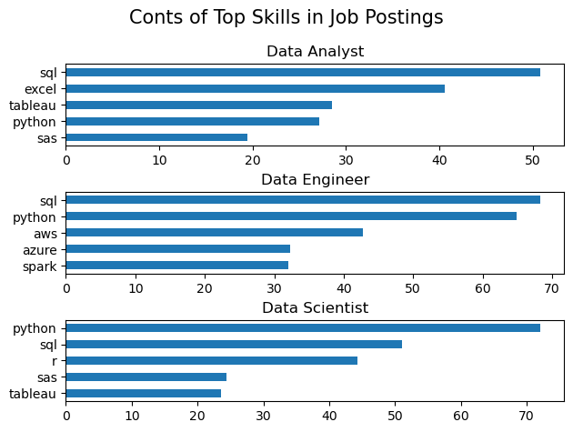
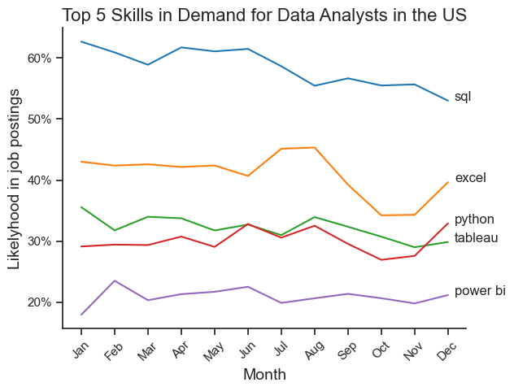
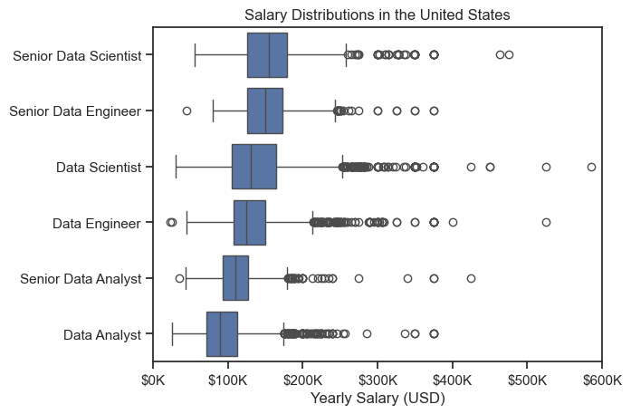

# Overview
Welcome to my analysis of the data job market, focusing on data analyst roles. This project was created out of a desire to navigate and understand the job market more effectively. It delves into the top-paying and in-demand skills to help find optimal job opportunities for data analysts.

The data sourced from Luke Barousse's Python Course which provides a foundation for my analysis, containing detailed information on job titles, salaries, locations, and essential skills. Through a series of Python scripts, I explore key questions such as the most demanded skills, salary trends, and the intersection of demand and salary in data analytics.

# The Questions
Below are the questions I want to answer in my project:

1.What are the skills most in demand for the top 3 most popular data roles?

2.How are in-demand skills trending for Data Analysts?

3.How well do jobs and skills pay for Data Analysts?

# Tools I Used
For my deep dive into the data analyst job market, I harnessed the power of several key tools:

- Python: The backbone of my analysis, allowing me to analyze the data and find critical insights.I also used the following Python libraries:
  * Pandas Library: This was used to analyze the data.
  - Matplotlib Library: I visualized the data.
  - Seaborn Library: Helped me create more advanced visuals.
- Jupyter Notebooks: The tool I used to run my Python scripts which let me easily include my notes and analysis.
- Visual Studio Code: My go-to for executing my Python scripts.
- Git & GitHub: Essential for version control and sharing my Python code and analysis, ensuring collaboration and project tracking.

# Data Preparation and Cleanup
This section outlines the steps taken to prepare the data for analysis, ensuring accuracy and usability.

## Import & Clean Up Data
```
# Importing Libraries
import ast
import pandas as pd
import seaborn as sns
from datasets import load_dataset
import matplotlib.pyplot as plt  

# Loading Data
dataset = load_dataset('lukebarousse/data_jobs')
df = dataset['train'].to_pandas()

# Data Cleanup
df['job_posted_date'] = pd.to_datetime(df['job_posted_date'])
df['job_skills'] = df['job_skills'].apply(lambda x: ast.literal_eval(x) if pd.notna(x) else x)
```

## Filter US Jobs
```
df_US = df[df['job_country'] == 'United States']
```

# The analysis
## 1.What are the most demanded skills for the top 3 most data roles?
To find the most demanded skills for the top 3 most popular data roles. I filtered out those positions by which ones were the most popular, and got the top 5 skills for these top 3 roles. This query highlights the most popular job titles and their top skills, showing which skills I should pay attention to depending on the role I'm targeting.

View my notebook with detailed steps here:  [2_Skill_Demand.ipynb](02_Skill_Demand.ipynb)

### Visualize Data
```fig, ax = plt.subplots(len(job_titles), 1)
for i, job_title in enumerate(job_titles):
    df_plot = df_skill_perc[df_skill_perc['job_title_short'] == job_title].head(5)
    df_plot.plot(kind='barh',x='job_skills',y='skill_percent',ax=ax[i],title=job_title)
    ax[i].invert_yaxis()
    ax[i].set_ylabel('')
    ax[i].legend().set_visible(False)
 

fig.suptitle('Conts of Top Skills in Job Postings',fontsize=15)
fig.tight_layout(h_pad=0.5)
plt.show()
plt.show()
```
### Results


### Insights 
- SQL is the most requested skill for Data Analysts and Data Scientists, with it in over half the job postings for both roles. For Data Engineers, Python is the most sought-after skill, appearing in 68% of job postings.

- Data Engineers require more specialized technical skills (AWS, Azure, Spark) compared to Data Analysts and Data Scientists who are expected to be proficient in more general data management and analysis tools (Excel, Tableau).

- Python is a versatile skill, highly demanded across all three roles, but most prominently for Data Scientists (72%) and Data Engineers (65%).


## 2. How are in demand skills trending for data analyst?
To find how skills are trending in 2023 for Data Analysts, I filtered data analyst positions and grouped the skills by the month of the job postings. This got me the top 5 skills of data analysts by month, showing how popular skills were throughout 2023.

View my notebook with detailed steps here: [03_Skills_Trends.ipynb](03_Skills_Trends.ipynb)

### Visualize Data
```
sns.lineplot(data=df_plot,dashes=False,palette='tab10')
sns.set_theme(style='ticks')
sns.despine()
plt.title('Top 5 Skills in Demand for Data Analysts in the US', fontsize=16)
plt.xlabel('Month', fontsize=14)
plt.ylabel('Likelyhood in job postings', fontsize=14)
plt.legend().remove()
from matplotlib.ticker import PercentFormatter
ax=plt.gca()
ax.yaxis.set_major_formatter(PercentFormatter(decimals=0))
plt.xticks(rotation=45)

for i in range(5):
    plt.text(11.2, df_plot.iloc[-1,i], df_plot.columns[i])
```
### Results


### Insights
- SQL remains the most consistently demanded skill throughout the year, although it shows a gradual decrease in demand.
- Excel experienced a significant increase in demand starting around September, surpassing both Python and Tableau by the end of the year.
- Both Python and Tableau show relatively stable demand throughout the year with some fluctuations but remain essential skills for data analysts. Power BI, while less demanded compared to the others, shows a slight upward trend towards the year's end.

## 03 How well do jobs and skills pat for data analytics?
To identify the highest-paying roles and skills, I only got jobs in the United States and looked at their median salary. But first I looked at the salary distributions of common data jobs like Data Scientist, Data Engineer, and Data Analyst, to get an idea of which jobs are paid the most.

View my notebook with detailed steps here: [4_Salary_Analysis](04_Salary_Analysis.ipynb)

### Visualize Data
```
sns.boxplot(data=df_US_top_6, x='salary_year_avg', y='job_title_short',order=job_order)
sns.set_theme(style='ticks')
plt.title('Salary Distributions in the United States')
plt.xlabel('Yearly Salary (USD)')
plt.ylabel('')
plt.xlim(0, 600000)
ticks_x = plt. FuncFormatter(lambda y, pos: f'${int(y/1000)}K')
plt.gca().xaxis.set_major_formatter(ticks_x)
plt.show()
``` 
### Results


### Visualize Data
```
fig,ax =plt.subplots(2,1)
sns.set_theme(style='ticks')

sns.barplot(data=df_DA_US_top_pay, x='median', y=df_DA_US_top_pay.index, hue='median', ax=ax [0], palette='dark:b_r')
ax [0].legend().remove()


ax[0].set_title('Top 10 Highest Paid Skills for Data Analysts')
ax [0].set_ylabel('')
ax[0].set_xlabel('')
ax[0].xaxis.set_major_formatter(plt.FuncFormatter(lambda x, _: f'${int(x/1000)}K'))

sns.barplot(data=df_DA_skills, x='median', y=df_DA_skills.index, hue='median', ax=ax[1], palette='light:b')
ax [1].legend().remove()

ax [1].set_title('Top 10 Most In-Demand Skills for Data Analysts')
ax [1].set_ylabel('')
ax [1].set_xlabel('Median Salary (USD)')
ax [1].set_xlim(ax[0].get_xlim()) 

ax [1].xaxis.set_major_formatter (plt. FuncFormatter(lambda x,_:f'${int(x/1000)}K'))
plt.tight_layout()
plt.show()
```


### Insights
- There's a significant variation in salary ranges across different job titles. Senior Data Scientist positions tend to have the highest salary potential, with up to $600K, indicating the high value placed on advanced data skills and experience in the industry.

- Senior Data Engineer and Senior Data Scientist roles show a considerable number of outliers on the higher end of the salary spectrum, suggesting that exceptional skills or circumstances can lead to high pay in these roles. In contrast, Data Analyst roles demonstrate more consistency in salary, with fewer outliers.

- The median salaries increase with the seniority and specialization of the roles. Senior roles (Senior Data Scientist, Senior Data Engineer) not only have higher median salaries but also larger differences in typical salaries, reflecting greater variance in compensation as responsibilities increase.
